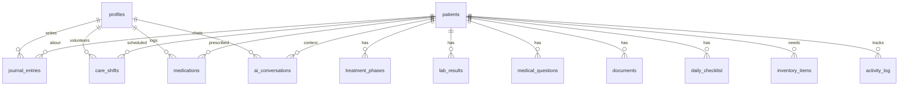

# LinfoCare — Product Requirements Document (PRD)

**Product:** LinfoCare PWA  
**Version:** 1.0  
**Authors:** AI Huevos Engineering  
**Last Updated:** April 19, 2026  
**Status:** Draft — Awaiting Stakeholder Review  

---

## 1. Overview

### 1.1 Problem Statement

A Spanish-speaking family in Colombia is caring for an elderly relative ("Roro", 78 years old) recently diagnosed with **Diffuse Large B-Cell Lymphoma (DLBCL), Stage IV** — an aggressive but potentially curable blood cancer. The family faces three compounding challenges:

1. **Medical complexity** — DLBCL Stage IV involves chemotherapy regimens (R-CHOP / R-mini-CHOP), ICU care, lab monitoring (LDH, plaquetas, hemoglobina), infection surveillance, and tumor lysis syndrome prevention. The medical documents are dense, clinical, and in mixed Spanish/English.
2. **Coordination overhead** — 8+ family members rotate hospital accompaniment shifts, track supplies, manage daily checklists, and communicate status via WhatsApp.
3. **Health literacy gap** — Non-medical family members need to interpret lab results, understand treatment phases, recognize red flags (fiebre ≥38°C = emergencia), and ask the right questions to treating physicians.

> [!IMPORTANT]
> The patient population is **elderly family caregivers in Latin America** — many with limited digital literacy. The app must be radically simple, warm, and self-explanatory.

### 1.2 Product Vision

LinfoCare is a **Progressive Web App (PWA)** that serves as a family-operated command center for coordinating the care of a hospitalized lymphoma patient. It translates clinical complexity into plain-Spanish guidance, organizes family logistics, and provides an AI assistant ("Doctora Lío") that answers medical questions with contextual awareness.

### 1.3 Target Users

| Persona | Description | Primary Needs |
|---------|-------------|---------------|
| **Cuidador Principal** (Primary Caregiver) | Stay-at-home family member managing daily hospital visits | Shift scheduling, daily checklist, inventory tracking, WhatsApp summaries |
| **Familiar Médico** (Medical Liaison) | Tech-savvy family member who interfaces with physicians | Lab interpretation, document management, treatment timeline, questions for doctors |
| **Familiar Remoto** (Remote Family) | Lives far away, follows via WhatsApp group | Daily broadcast summaries, real-time treatment status, prayer/support log |
| **Roro's Children** (Decision Makers) | Make clinical decisions with oncology team | Diagnosis explainers, treatment scenarios, risk/benefit analysis, AI Q&A |

### 1.4 Success Criteria

| Metric | Target | Measurement |
|--------|--------|-------------|
| Task completion rate | ≥90% for core workflows | Analytics + usability testing |
| Time to understand diagnosis | ≤5 min from first visit | User interviews |
| WhatsApp summary accuracy | ≥95% factual correctness | Manual QA review |
| Family onboarding time | ≤2 min (scan QR → browsing) | Session analytics |
| PWA install rate | ≥60% of active users | Service worker metrics |
| Doctora Lío response quality | 13/13 categories pass (see QA report) | Automated test suite |

---

## 2. Product Architecture

### 2.1 Technology Stack

| Layer | Technology | Rationale |
|-------|------------|-----------|
| **Frontend** | Vite 8 + React 19 + React Router v7 | Fast HMR, modern React, SPA routing |
| **Styling** | Tailwind CSS 3.4 | Utility-first; stone/sky/rose/amber/emerald palette |
| **Typography** | Playfair Display (headings) + Inter (body) | Warm, readable, professional |
| **Backend** | Supabase (Postgres + Auth + Storage + RLS) | Open-source Firebase alternative; magic-link OTP |
| **AI** | Vercel AI SDK v6 + OpenAI `gpt-4o-mini` | Streaming chat, contextual system prompt |
| **Deployment** | Vercel (frontend + Edge Functions) | Zero-config, preview deploys, CDN |
| **PWA** | `vite-plugin-pwa` | Offline-first for poor hospital WiFi |
| **Icons** | `lucide-react` | Modern, consistent, tree-shakeable |

### 2.2 Database Schema (14 Tables)



**Tables:** `profiles`, `patients`, `treatment_phases`, `lab_results`, `medical_questions`, `journal_entries`, `medications`, `care_shifts`, `daily_checklist`, `inventory_items`, `documents`, `activity_log`, `ai_conversations`

**Security:** RLS enabled on all tables. Authenticated users can read/write. Admin role required for patient creation/updates. Auto-profile creation on auth signup via trigger.

### 2.3 Authentication

- **Method:** Supabase magic-link OTP (passwordless email)
- **Dev Fallback:** Hardcoded `DEMO_USER` when env vars are missing — app runs without credentials
- **Session:** Managed via `AuthContext` + `useAuth()` hook
- **Guard:** `<ProtectedRoute>` wrapper redirects unauthenticated users to Login

---

## 3. Feature Specifications

### 3.1 Module: Medical Record (`/medical/*`)

#### 3.1.1 Diagnosis Page (`/medical/diagnosis`)

**Purpose:** Translate DLBCL Stage IV into plain Spanish that any family member can understand.

| Requirement | Detail |
|-------------|--------|
| Summary card | Gradient highlight with diagnosis name, staging pills (Estadio IV, IPI alto, DLBCL, 78 años) |
| Stage explainer | Visual grid comparing Stadio I-IV with Roro's highlighted |
| Key findings | Color-coded findings (critical/warn/info): SUVmax 26.7, LDH 2010, Albúmina 2.5, Plaquetas 64K, Hemoglobina 8.1, duodenal lesion, pleural effusion, bone lesions |
| Treatment preview | R-CHOP drug breakdown (Rituximab, Ciclofosfamida, Doxorrubicina, Vincristina, Prednisona) with family-friendly descriptions |
| Week-by-week guide | Timeline of what to expect from pre-phase through Cycle 1 recovery |

#### 3.1.2 Body Map (`/medical/bodymap`)

**Purpose:** Interactive 3D-ish body visualization showing where the disease affects Roro.

| Requirement | Detail |
|-------------|--------|
| SVG body regions | Clickable zones: head, chest/lungs, abdomen/GI, pelvis/bones, blood/marrow |
| Lesion markers | Animated pulse markers at affected sites (duodeno, derrame pleural, lesiones óseas) |
| Detail panels | On-click panels explaining the finding in plain Spanish |

#### 3.1.3 Lab Results (`/medical/labs`)

| Requirement | Detail |
|-------------|--------|
| Chart visualization | Time-series charts for LDH, plaquetas, hemoglobina, creatinina, albumina |
| Normal ranges | Shaded bands showing safe vs. critical zones |
| Trend indicators | Arrow icons showing if values are improving or worsening |
| Data entry | Manual entry form with date, value, units, notes |
| Supabase sync | Real-time persistence via `lab_results` table |

#### 3.1.4 Treatment Plan (`/medical/treatment`)

| Requirement | Detail |
|-------------|--------|
| Phase accordion | Expandable phases: UCI Hemato-Oncología (active), Definición del protocolo (upcoming), Inicio quimioterapia (planned) |
| Confirmed medications | 5 authorized drugs: Vincristina, Dexametasona, Ondansetrón, Piperacilina, Rosuvastatina |
| Red flags per phase | Phase-specific warning signs with emergency actions |
| Labs to watch | Phase-specific lab monitoring requirements |
| Timeline | Chronological real dates (April 6 → ongoing) |
| R-CHOP reference | Collapsed educational material (clearly marked as NOT confirmed) |

#### 3.1.5 Medications (`/medical/medications`)

| Requirement | Detail |
|-------------|--------|
| Active vs. inactive grouping | Visual separation of current vs. completed medications |
| Drug cards | Name, dose, route, frequency, start/end dates, notes |
| Category tagging | Quimio (violet), soporte (emerald), crónico (stone) |
| Supabase CRUD | Full create/read/update via `medications` table |

#### 3.1.6 Documents (`/medical/documents`)

| Requirement | Detail |
|-------------|--------|
| Upload flow | Supabase Storage (`documents` bucket) — public read, authenticated write |
| Document types | Biopsy, lab_report, imaging, discharge, consent, research, other |
| Metadata display | Title, type pill, upload date, file size, uploader |
| View/download | In-browser viewing for PDFs and images |

#### 3.1.7 Questions for Doctors (`/medical/questions`)

| Requirement | Detail |
|-------------|--------|
| Grouped questions | Categorized by topic (diagnosis, treatment, supportive care, prognosis) |
| Status tracking | Unanswered → Answered (with who and when) |
| AI-suggested questions | Pre-loaded from clinical research (see [research doc](file:///Users/naboo/Downloads/linfo-care/Research/Diffuse%20Large%20B-Cell%20Lymphoma%20in%20an%20Elderly%20ICU%20Patient%20in%20Latin%20America.md)) |

---

### 3.2 Module: Family Hub (`/family/*`)

#### 3.2.1 Care Shifts (`/family/shifts`)

| Requirement | Detail |
|-------------|--------|
| Weekly calendar grid | 7-day × 3-slot (mañana/tarde/noche) clickable matrix |
| Self-assignment | Click empty slot → auto-assign with display name |
| Real-time sync | All family members see changes via Supabase real-time |
| Navigation | Week forward/backward with "hoy" quick-return |
| Today's summary | Dedicated card showing who is on each shift today |

#### 3.2.2 Journal (`/family/journal`)

| Requirement | Detail |
|-------------|--------|
| Entry types | Note, observation, doctor_update, mood |
| Rich input | Text area with date stamp and author attribution |
| Timeline view | Reverse-chronological with type-based icons |
| Searchable | Filter by entry type and date range |

#### 3.2.3 Supply Inventory (`/family/inventory`)

| Requirement | Detail |
|-------------|--------|
| Category groups | Medical supplies, comfort items, food/nutrition, hygiene |
| Status workflow | Missing → Pending → Buying → Have |
| Assignment | "Assigned to" field for who's bringing what |
| Quick-add | Button to add common items from templates |

#### 3.2.4 Daily Checklist (`/family/checklist`)

| Requirement | Detail |
|-------------|--------|
| Predefined items | Oral care, repositioning, hydration, vitals check, nutrition, etc. |
| Date-scoped | Resets daily; historical entries persisted |
| Completion tracking | Checkbox with who-and-when metadata |

#### 3.2.5 WhatsApp Export (`/family/export`)

| Requirement | Detail |
|-------------|--------|
| Auto-generated summary | Pulls today's labs, shift assignments, journal entries, checklist status |
| Copy to clipboard | One-tap copy formatted for WhatsApp group broadcast |
| Tone control | Calm, informative, family-appropriate language |

---

### 3.3 Module: Care Guide (`/care/*`)

#### 3.3.1 Nutrition (`/care/nutrition`)

| Requirement | Detail |
|-------------|--------|
| Phase-aware diet | Different recommendations for pre-chemo, nadir, recovery |
| Food safety | Neutropenia-safe food guidelines (avoid raw, wash thoroughly) |
| Hydration tracking | Daily intake goals with visual progress |
| Recipes | Soft, high-calorie, high-protein options for a malnourished patient |

#### 3.3.2 Daily Care Protocols (`/care/daily`)

| Requirement | Detail |
|-------------|--------|
| Oral care protocol | Step-by-step bicarbonate rinse, inspection checklist |
| Skin/pressure prevention | Repositioning schedule, skin assessment guide |
| Infection prevention | Hand hygiene, visitor rules, PPE guidance |
| Pain assessment | Non-verbal pain scales for elderly/delirious patients |

---

### 3.4 Module: Reference (`/reference/*`)

#### 3.4.1 Glossary (`/reference/glossary`)

| Requirement | Detail |
|-------------|--------|
| Medical terms | DLBCL, SUVmax, LDH, R-CHOP, nadir, neutropenia, etc. |
| Plain-Spanish definitions | No jargon; analogies and context |
| Searchable | Filter by letter or keyword |

#### 3.4.2 Emergency Scenarios (`/reference/scenarios`)

| Requirement | Detail |
|-------------|--------|
| Decision cards | "Roro tiene fiebre" → what to do, who to call, what to bring |
| Color-coded severity | Critical (rose), warning (amber), info (sky) |
| Step-by-step | Numbered action items for each scenario |

---

### 3.5 Module: AI Assistant — Doctora Lío (`/chat`)

| Requirement | Detail |
|-------------|--------|
| Persona | "Doctora Lío" — calm, precise, compassionate AI assistant |
| Context | Full patient context: DLBCL Stage IV, labs, protocols, medications embedded in system prompt |
| Model | OpenAI `gpt-4o-mini` via Vercel AI SDK `streamText()` |
| Streaming | Token-by-token streaming via data stream protocol |
| Fallback | Local keyword-based responses when API is unreachable |
| Categories | Clinical terms, lab interpretation, care instructions, safety, family org, edge cases |
| Guardrails | Always responds in Spanish. Never gives definitive medical advice. Frames as questions for physicians |
| QA | 13/13 test categories pass (see [QA Report](file:///Users/naboo/Downloads/linfo-care/linfo-care-app/qa-report.md)) |
| Suggested prompts | 4 pre-loaded quick-ask chips |
| Disclaimer | "Doctora Lío no reemplaza al equipo médico" |

---

## 4. Non-Functional Requirements

| Requirement | Target | Implementation |
|-------------|--------|----------------|
| **Performance** | FCP < 1.5s, TTI < 3s | Vite code splitting, lazy-loaded routes, optimized images |
| **Accessibility** | WCAG 2.1 AA | Large touch targets (≥44px), high contrast, readable fonts (16px+ body) |
| **Offline** | Core pages available offline | Service worker via `vite-plugin-pwa`, cache-first strategy |
| **Localization** | Spanish (es-CO) only | All UI copy in Colombian Spanish |
| **Security** | RLS, OTP auth, no PHI in client | Supabase RLS policies, magic-link auth, env var isolation |
| **Privacy** | HABEAS DATA (Colombia) compliant | Data stays in Supabase (us-east-1), user consent on signup |
| **Mobile-first** | Usable on budget Android phones | Responsive Tailwind grid, PWA installable |
| **Reliability** | 99.5% uptime | Vercel edge, Supabase managed Postgres |

---

## 5. Roadmap

### Phase 1: Core MVP ✅ (Completed)
- [x] Authentication (magic-link OTP + demo fallback)
- [x] Dashboard with treatment timeline and lab summaries
- [x] Diagnosis explainer page
- [x] Treatment plan with confirmed medications
- [x] Body map visualization
- [x] Lab results with charts
- [x] Medications tracking
- [x] Document upload/management
- [x] Questions for doctors
- [x] Care shifts calendar (real-time sync)
- [x] Family journal
- [x] Supply inventory
- [x] Daily checklist
- [x] WhatsApp broadcast export
- [x] Nutrition guide
- [x] Daily care protocols
- [x] Glossary + Emergency scenarios
- [x] Doctora Lío AI chat (streaming + fallback)
- [x] PWA manifest + service worker

### Phase 2: Data Integration (In Progress)
- [ ] Process lab history PDF (`1804 Historico Laboratorio.pdf`) → seed `lab_results`
- [ ] Google Drive sync via Supabase Edge Functions + pg_cron
- [ ] Real-time lab trend alerts (push notifications)
- [ ] Automate WhatsApp summary from live data

### Phase 3: Intelligence Layer
- [ ] Upgrade Doctora Lío to Claude Opus 4 (longer context, better clinical reasoning)
- [ ] Document OCR pipeline (upload PDF → auto-extract labs + notes)
- [ ] Proactive alerts ("LDH trend suggests discuss with oncology")
- [ ] Multi-patient support (generalize beyond Roro)

### Phase 4: Scale
- [ ] Multi-language (English, Portuguese)
- [ ] Hospital integration APIs (HL7 FHIR)
- [ ] Publishable as open-source template for cancer caregiver families
- [ ] Mobile native wrapper (Capacitor)

---

## 6. Open Questions

> [!WARNING]
> **Decision required from stakeholder:**

1. **Treatment protocol update cadence** — How does the family update treatment data when oncology changes the plan? Manual journal entry or semi-automated?
2. **Data retention** — How long should journal entries, lab results, and chat transcripts be retained?
3. **Multi-patient** — Is there intent to support multiple patients per family account?
4. **Notification channels** — Push notifications vs. WhatsApp API for alerts?

---

## 7. How Claude Opus 4 Implements Each Feature

> [!NOTE]
> This section explains exactly how you would use **Claude Opus 4** (the model you're currently using) as your AI coding agent to implement each feature area of LinfoCare. This is a practical guide for prompting strategy and workflow design.

### 7.1 Understanding the Model's Role

Claude Opus 4 is not a runtime component of LinfoCare (that role belongs to GPT-4o-mini for Doctora Lío). Instead, Opus 4 serves as your **implementation partner** — the coding agent that:

- **Reads** the entire codebase in context (CLAUDE.md, all JSX components, SQL schema, research docs)
- **Plans** architecture decisions (e.g., "should we use Supabase Edge Functions or Vercel Edge for OCR?")
- **Writes** full components (JSX + Tailwind + Supabase integration)
- **Tests** by running dev server, reading console output, QA-checking screenshots
- **Iterates** on design feedback by modifying specific component files

### 7.2 Implementation Strategy by Feature

#### Medical Record Module

| Feature | How Opus 4 Implements It |
|---------|--------------------------|
| **Lab History PDF Processing** | Opus 4 reads the PDF, extracts structured lab data (lab name, value, date, units), and generates a SQL `INSERT` seed script for the `lab_results` table. It can parse the tabular lab data from the Colombian hospital format and map it to the schema. |
| **Lab Chart Improvements** | Opus 4 writes the chart components using inline SVG or a lightweight chart library, computing trend lines, normal-range bands, and date-axis formatting — all in a single `LabResults.jsx` rewrite. |
| **Document OCR Pipeline** | Opus 4 designs and implements a Vercel Edge Function that accepts a PDF upload, calls an OCR API (Google Vision or Tesseract.js), and returns structured JSON. It writes both the Edge Function and the React upload flow. |

#### Family Hub Module

| Feature | How Opus 4 Implements It |
|---------|--------------------------|
| **Real-time Shift Sync** | Opus 4 modifies `CareShifts.jsx` to add Supabase real-time subscriptions (`supabase.channel('shifts').on('postgres_changes', ...)`) so all family members see shift changes instantly without page refresh. |
| **WhatsApp Auto-Summary** | Opus 4 writes a function that queries today's `lab_results`, `care_shifts`, `journal_entries`, and `daily_checklist` from Supabase, formats them into a WhatsApp-friendly text with emojis, and renders it with a copy button. |
| **Push Notifications** | Opus 4 implements the service worker push subscription, Supabase webhook trigger, and Vercel Edge Function to send web push notifications when critical lab values are entered or shifts change. |

#### AI Assistant (Doctora Lío)

| Feature | How Opus 4 Implements It |
|---------|--------------------------|
| **Model Upgrade** | To upgrade Doctora Lío from GPT-4o-mini to Claude Opus 4 as the *runtime* model, Opus 4 (the implementation agent) rewrites the Vercel Edge Function at `api/chat` to use `@ai-sdk/anthropic` instead of `@ai-sdk/openai`, adjusts the system prompt for Claude's style, and runs the 13-category QA test suite to verify parity. |
| **Contextual RAG** | Opus 4 implements a retrieval layer: it writes a Supabase function that fetches Roro's latest labs, medications, and treatment phase, then injects this dynamic context into the system prompt before each chat turn — so Doctora Lío always has current data. |
| **Document Q&A** | Opus 4 designs a flow where uploaded PDFs are chunked, embedded via OpenAI embeddings, stored in Supabase `pgvector`, and retrieved at query time to ground Doctora Lío's responses in actual medical documents. |

#### Care Guide Module

| Feature | How Opus 4 Implements It |
|---------|--------------------------|
| **Treatment-Phase-Aware Content** | Opus 4 reads the current `treatment_phases` status from Supabase and conditionally renders different nutrition/care protocols based on whether Roro is in UCI, pre-fase, nadir, or recovery. It modifies `Nutrition.jsx` and `DailyCare.jsx` to be data-driven rather than static. |
| **Interactive Checklists** | Opus 4 connects the static checklist UI to the `daily_checklist` Supabase table, adding create-on-check, undo-on-uncheck, and historical completion rates with progress bars. |

### 7.3 Optimal Prompting Strategy for Opus 4

```
┌───────────────────────────────────────────────┐
│         OPUS 4 IMPLEMENTATION WORKFLOW        │
├───────────────────────────────────────────────┤
│                                               │
│  1. CONTEXT LOADING                           │
│     • CLAUDE.md (conventions, stack, rules)   │
│     • Target component source code            │
│     • Database schema (migration.sql)         │
│     • Research docs (clinical reference)      │
│                                               │
│  2. PLANNING                                  │
│     • Create implementation_plan.md           │
│     • Identify dependencies                   │
│     • Flag decisions for user review          │
│     • User approves plan                      │
│                                               │
│  3. EXECUTION                                 │
│     • Write/modify JSX components             │
│     • Write SQL migrations if needed          │
│     • Write Edge Functions for backend logic  │
│     • Track progress in task.md               │
│                                               │
│  4. VERIFICATION                              │
│     • Run `npm run build` (catch errors)      │
│     • Run `npm run lint` (code quality)       │
│     • Browser test live app (screenshots)     │
│     • Run QA test suite (for AI features)     │
│                                               │
│  5. DOCUMENTATION                             │
│     • Create walkthrough.md with changes      │
│     • Update CLAUDE.md if conventions change  │
│     • Embed screenshots of UI changes         │
│                                               │
└───────────────────────────────────────────────┘
```

### 7.4 Key Advantages of Opus 4 for This Project

1. **Deep Context Window** — Opus 4 can hold the entire codebase (20+ JSX files, SQL schema, research docs, QA report) in a single conversation context. This means it understands cross-cutting concerns like the shared UI components, auth patterns, and Supabase query style without re-explanation.

2. **Clinical Reasoning** — When writing medical-facing features (diagnosis explainers, lab interpretation, drug information), Opus 4 can reference the clinical research document and ensure accuracy. It won't hallucinate drug dosages or staging information.

3. **Bilingual Code/Content** — The codebase requires all UI copy in Spanish while code comments, variables, and architecture docs stay in English. Opus 4 handles this naturally, writing `<SectionTitle>Diagnóstico de Roro</SectionTitle>` in the JSX while keeping `const confirmedMeds = [...]` in English.

4. **Full-Stack Execution** — Opus 4 can write React components, Supabase SQL migrations, Vercel Edge Functions, service worker configs, and Tailwind styling in a single task — without switching tools or losing context.

5. **Iterative Refinement** — When the user says "the lab chart doesn't look right on mobile," Opus 4 can take a browser screenshot, identify the CSS issue, modify 3 lines of Tailwind classes, and verify the fix — all in one turn.

### 7.5 Example Opus 4 Prompts for Each Phase

**Phase 2 kickoff:**
> "Process the 1804 Historico Laboratorio.pdf — extract all lab values (name, value, unit, date, normal range) and generate SQL INSERT statements for the lab_results table. Map the Colombian hospital lab names to consistent English lab_name values."

**Phase 3 kickoff:**
> "Upgrade Doctora Lío to use Claude as the runtime model. Rewrite api/chat to use @ai-sdk/anthropic. Update the system prompt to embed live patient data from Supabase (latest labs, active meds, current treatment phase). Then run the 13-category QA suite and report results."

**Ad-hoc feature:**
> "Add real-time Supabase subscriptions to CareShifts.jsx so when one family member signs up for a shift, all other open browsers see the change instantly without refresh. Use supabase.channel() with postgres_changes."

---

## 8. Appendix

### A. Research Documents Inventory

| File | Type | Contents |
|------|------|----------|
| `DOCTORALIO.MD` | System prompt | AI assistant persona and output format specification |
| `Diffuse Large B-Cell Lymphoma in an Elderly ICU Patient in Latin America.md` | Clinical reference | Treatment protocols, supportive care, red flags, family guidance — 26 peer-reviewed references |
| `1804 Historico Laboratorio.pdf` | Lab data | Complete lab history for data extraction |
| `1304 CO80232782 - PET SCAN INFORME.pdf` | Imaging | PET-CT report (SUVmax 26.7) |
| `Patologia Estomago.pdf` / `Patologia Mielograma.pdf` | Pathology | Biopsy results confirming DLBCL |
| `Autorización Dexametasona.png` / `Monoterapia...png` | Admin | EPS treatment authorizations |
| `0604-1404 laboratorio *.pdf` (×10) | Labs | Individual lab result PDFs by date |
| `1204-1604 *.pdf` (×5) | Imaging | Skull CT, chest X-rays, portable studies |
| `Colonoscopia Total.jpeg` / `Esofagogastroduodenodoscopia.jpeg` | Endoscopy | GI procedure images |

### B. QA Test Results (Doctora Lío)

**13/13 passed** across 7 categories:
- Clinical term explanation (3/3)
- Lab interpretation (2/2)  
- Care instruction (2/2)
- Safety/emergency guidance (2/2)
- Family organization (2/2)
- Non-Spanish input handling (1/1)
- Off-topic deflection (1/1)

Average latency: **3,800ms** with OpenAI `gpt-4o-mini` via Vercel AI Gateway.
